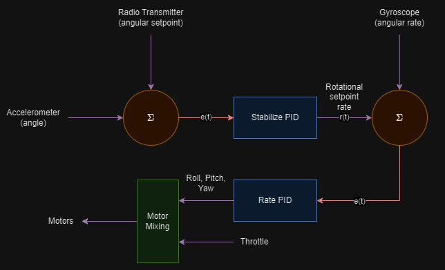
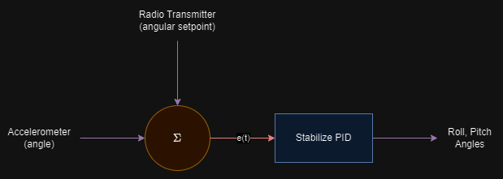
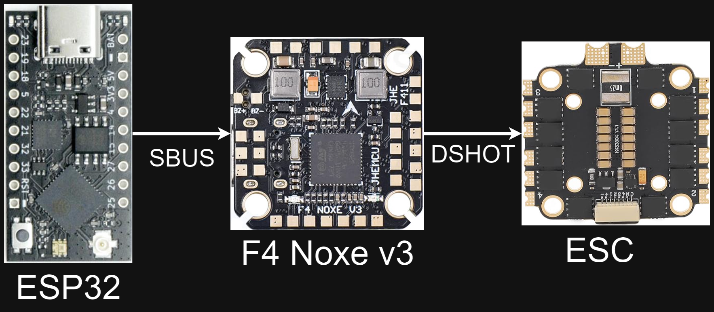
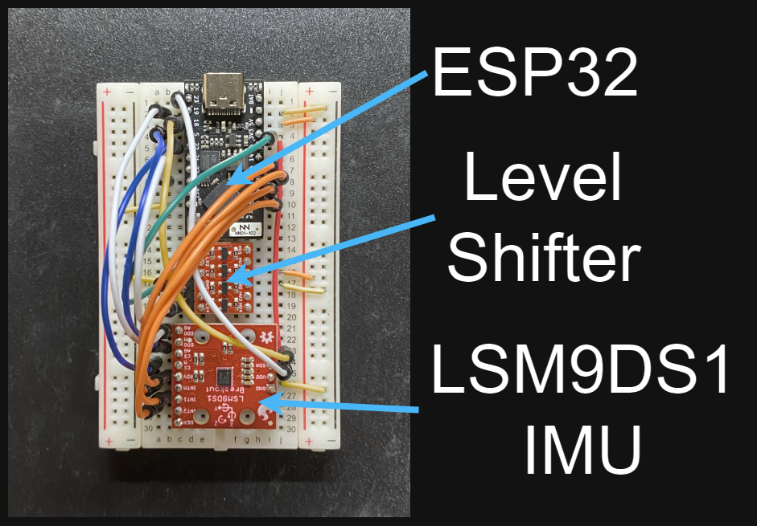
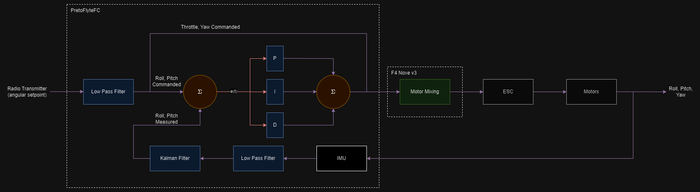
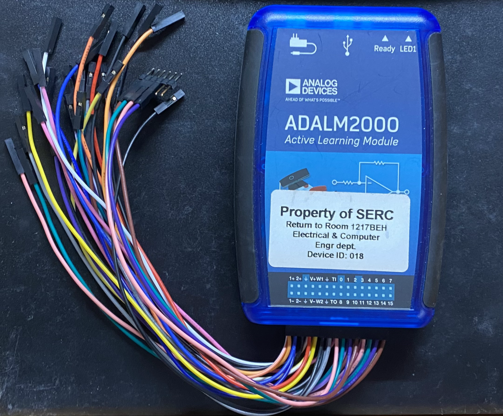
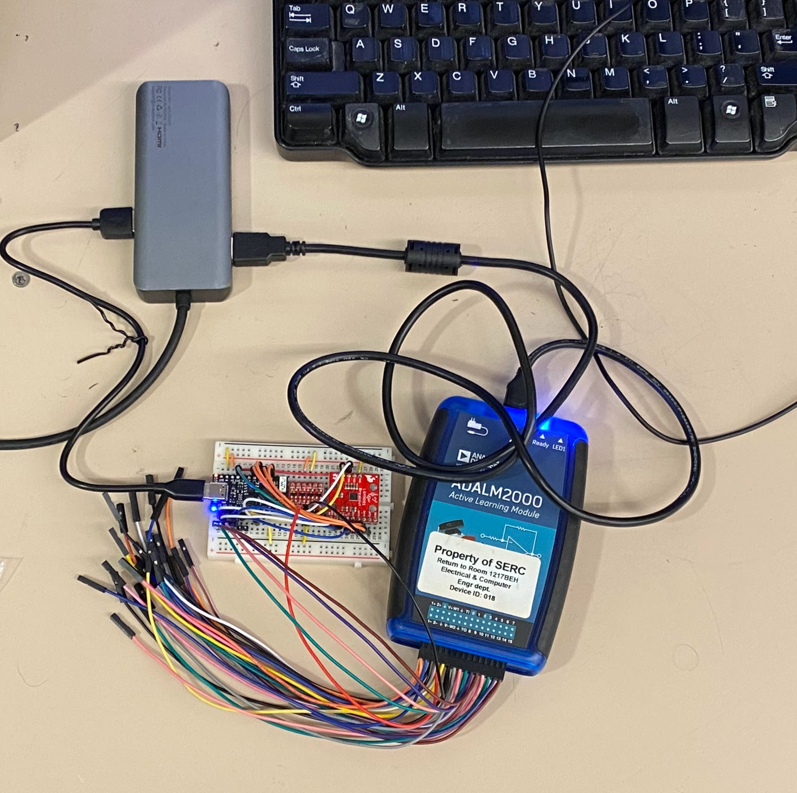
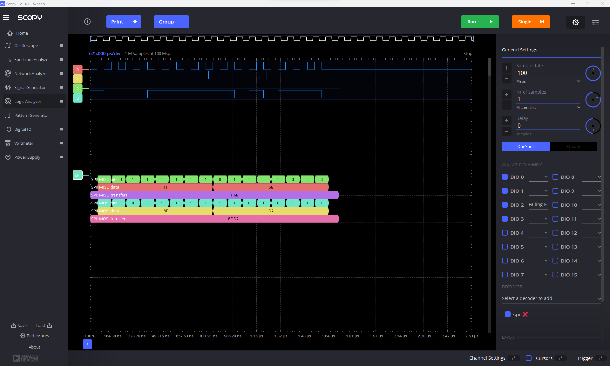
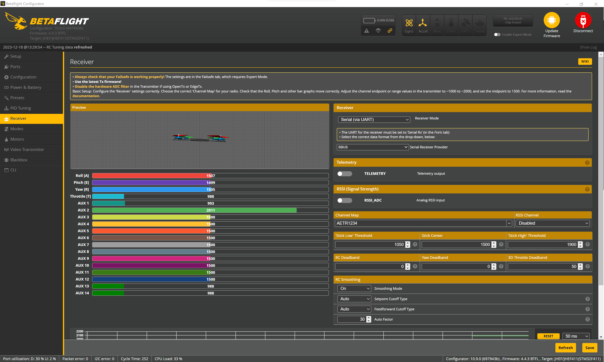

# PretoFlyteFC

Simple quadcopter flight controller based on an ESP32 and LSM9DS1

# NOTE: THIS README IS STILL IN PROGRESS.

This note will be removed to indicate that the README is finished. While this note remains, it should be assumed that this README is still a work in progress. I would greatly appreciate final consideration after this note has been removed.

## Table of Contents

<!-- TODO re-organize table of contents (repo org and build instr after design overview?) -->

- [Design Overview](#design-overview)
- [Justification](#justification)
- [Preliminary Design Verification](#preliminary-design-verification)
  - [Spinning the Motors](#spinning-the-motors)
  - [IMU](#imu)
  - [Radio Transmitter/Receiver](#radio-transmitterreceiver)
- [Design Implementation](#design-implementation)
  - [Control Architecture](#control-architecture)
    - [Accelerometer Trigonometry and Gyroscope Rates](#accelerometer-trigonometry-and-gyroscope-rates)
    - [Low pass filter](#low-pass-filter)
    - [Kalman filter](#kalman-filter)
    - [PID control](#pid-control)
  - [Motors and ESC](#motors-and-esc)
  - [Quadcopter Frame](#quadcopter-frame)
  - [Radio Control System](#radio-control-system)
  - [IMU](#imu-1)
  - [SBUS](#sbus)
    <!-- - [Github Actions](#github-actions) -->
    <!-- - [Bill of Materials](#bill-of-materials) -->
- [Design Testing](#design-testing)
  - [Re-pinning the flight controller to ESC connector](#re-pinning-the-flight-controller-to-esc-connector)
  - [IMU driver debugging](#imu-driver-debugging)
  - [Plotter](#plotter)
  - [SBUS driver testing with Betaflight configuration tool](#sbus-driver-testing-with-betaflight-configuration-tool)
  - [Flying and PID Tuning](#flying-and-pid-tuning)
- [Conclusion](#conclusion)
  - [Future Work](#future-work)
- [Repository Organization](#repository-organization)
- [Build Instructions](#build-instructions)
- [Acknowledgements](#acknowledgements)

### Note:

Some images in this document maybe hard to see depending on the markdown viewer. To see the full size image,
simply click on it.

## Design Overview

<!-- TODO insert picture of complete build and potentially video -->

PretoFlyteFC is a simple flight controller for a small to medium-sized quadcopter and its purpose is to
stabilize roll and pitch. It primarily consists of an ESP32 microcontroller and an 9-axis LSM9DS1 inertial
measurement unit (IMU), which is equipped an accelerometer, gyroscope, and magnetometer. Generally, human
operators cannot react fast enough to even small perturbations in a quadcopter's flight, thus necessitating
additional control systems in the form of a flight controller to achieve stable flight. At a high level,
PretoFlyteFC works by reading in data from the accelerometer and gyroscope, filtering the signals,
inputting the filtered data and commanded angular set points into a PID (Proportional-Integral-Derivative)
contrl loop, and outputting roll and pitch signals that can then be used to control motor speed to achieve
the desired set point.


_Quadcopter roll, pitch, and yaw; Source: [http://blog.rctoysky.com/?p=128](http://blog.rctoysky.com/?p=128)_

The original design for PretoFlyteFC was meant to control roll and pitch in addition to roll rate, pitch
rate, and yaw rate using cascaded PID for both angular and angular rate setpoints as well as implement
motor mixing and direct communication with an electronic speed controller (ESC) for the motors. However,
due to time constraints, broken parts, and difficulties communicating with the ESC, the PretoFlyteFC was
narrowed in scope to only cover control of the roll and pitch angles.



_Original design_



_Revised design_

The quadcopter used to test and validate PretoFlyteFC was built from the SpeedyFPV 220 Racing Drone Kit
purchased from [Amazon.com](https://a.co/d/abwnG7r). The kit contains nearly all the essentials needed to
build an FPV (first person view) racing quadcopter, including a frame, motors, props, ESC, and even a flight
controller. The only part not included is a battery.

Inspiration and guidance for this project came from the _How to Write your own Flight Controller Software_ articles by David Such and the Carbon Aeronautics YouTube video series about how to build an drone based on Arduino.

_How to Write your own Flight Controller Software_: [https://reefwing.medium.com/how-to-write-your-own-flight-controller-software-part-1-ac08b6ecc01e](https://reefwing.medium.com/how-to-write-your-own-flight-controller-software-part-1-ac08b6ecc01e)

Carbon Aeronautics YouTube channel: [https://www.youtube.com/@carbonaeronautics/videos](https://www.youtube.com/@carbonaeronautics/videos)

## Justification

<!-- TODO mention limited exposure to drones -->

This project was purely a learning experience. I undertook this project because I have always been
interested in drones and UAVs but never had the time to work on a design like this. This project is also
a good opportunity to apply some of the control theory I have been studying in my mechatronics course and
to learn about signal filtering and sensor fusion. Furthermore, as someone who also plans to specifically
study drones and control theory in future courses, this project is a good introduction prior to the start
more formal study. Lastly, I plan to pursue a carrer in robotics in which all of these skills involved in
this project are very relevant and would strengthen my resume. After some initial testing and limiting the
scope of the design, I believed this project was meet the desired goals in the given time frame.

## Preliminary Design Verification

### Spinning the Motors

Some of the first parts of the quadcopter that were tested were the motors. After soldering the motors to the
ESC, the flight controller included in the kit was connected to the ESC with a provided cable. The specific
flight controller is the F4 Noxe v3 and it runs a well-known flight controller software called [Betalfight](https://betaflight.com/).
Betaflight has a software configuration tool that is used to setup and tune flight controllers running
Betaflight. The configuration tool is run on a computer connected to a Betaflight flight controller over USB.
The Betaflight configuration tool features a menu to configure and test a quadcopter's motors, which in this
case could be used to manually spin the motors to verify the worked and had be soldered correctly to the ESC.

_Betaflight configuration tool - motor test_

Upon verifying the ESC and motors worked by testing them with the Betaflight configuration tool, basic test
was done to see if the ESP32 could directly communicate the ESC to control the motors. There are several
different protocols used to communicate with ESCs such as Oneshoot, Multishot and DSHOT. Raw PWM signals can
also be used. The ESC included in the kit is a 4-in-1 45A ESC running the BLHeli_S firmware, and in theory it
is capable of detecting which protocl is being used for communication on the fly without any additional input.
To test if the ESP32 could communicate with the motors, a simple Arduino program was written to output a PWM
signal on a few of the ESP32's GPIO. These GPIO were then to connected to a input pads on the ESC for each
of the four motors. A simple circuit using the LM7805 linear voltage regulator was also contructed on a
breadboard to regulate the 7-8V supplied by the ESC down to the 5V required by the ESP32. Unfortuntely, the
ESP32 was unable to control the motors by sending PWM signals to the ESC. PWM from the ESP32 running the
Arduino test program resulted in intermitent twitching motors and random spinning instead of smooth rotation.
Therefore, since the flight controller included in the kit was known to be able successfully communicate with
the ESC and smoothly spin the motors, the decision was made that the F4 Noxe v3 flight controller would act as
a gateway between the ESP32 and the ESC, with the ESP32 sending commands to the F4 Noxe which would then in turn
send commands to the ESC. To accomplish this, the ESP32 would masquerade as a radio receiver connected to the
F4 Noxe and send roll, pitch, yaw, and throttle commands to it over a serial protocol commonly used by radio
controllers called SBUS. The F4 Noxe would then use DSHOT to communicate with the ESC. It was assumed that
writing an SBUS driver for the ESP32 would also be easier than writing a driver for one of the other protocols
used to communicate directly with an ESC.

_F4 Noxe v3 flight controller acts as SBUS-to-DSHOT gateway between ESP32 and ESC_

### IMU

The LSM9DS1 was chosen for this project because I already had one in my possession and fairly easy to work with.
It has largely been discontinued, but there is still plenty of support and documentation for it online. To verify
the IMU worked and communication could be established with it, a basic test program was written in Arduino and
uploaded to an Arduino Uno. The Uno was connected over SPI to the LSM9DS1 breakout board on a breadboard, and
was able to successfully print out the values of the X, Y, Z vectors for the accelerometer and gyroscope.

### Radio Transmitter/Receiver

Likewise, I was also already in possession of an old HK-T6A V2 radio transmitter and receiver. This a six-channel,
2.4 GHz digital proportional radio control system. Documentation for this radio system is scarce, especially
given that is discontinued. These older radio controllers often use PWM or PPM to communicate. In order to
determine which protocol this particular radio uses, receiver channels were connected to an oscilliscope while
the sticks, switches, and knobs on the radio transmitter were actuated. The scope displayed PWM signals and
measured the frequency to be around 50Hz with duty cycles varying between 4% and 10% depending on the position
or state of a given input to the transmitter.


## Design Implementation

<!-- TODO complete system diagram -->

The microcontroller selected for this project was the ESP32 because I am already in possession of several
ESP32 development boards and am very familiar with it and the [ESP-IDF SDK](https://docs.espressif.com/projects/esp-idf/en/latest/esp32/get-started/)
from Espressif (the company that produces the ESP32) used to program it. The specific development board
used in this project is the TinyPICO designed and manufactured by Seon Rozenblum AKA, Unexpected Maker.
This board was chosen in part for its small form factor, making it lightweight and easy to fit on a
small breadboard, and it highly capable ESP32-PICO-D4 SoC. The radio receiver's PWM outputs connect to
standard GPIO inputs on the ESP32 and the IMU communicates over SPI. The ESP32 receives 5V power from
the ESC via the F4 Noxe v3 and outputs the SBUS UART signal to the F4 Noxe v3 via a Sparkfun logic level
converter which converts the 3.3V logic from the ESP32 to the 5V logic required by the F4 Noxe v3. The
flight control software in this repository does not require any additional dependenices or libraries
aside from the ESP-IDF SDK and the standard C library.

<!-- TODO complete wiring diagram -->

_PretoFlyteFC wiring diagram_

The original plan was to assemble all the hardware on a breadboard and then solder it to perf board after
testing was complete, but due to a lack of time, this was not possible and the components remained on the
breadboard in the final design.



_PretoFlyteFC breadboard_

<!-- TODO software hierarchy diagram -->

### Control Architecture

_Control loop_

The commanded values for the flight control loop are the roll, pitch, yaw, and throttle inputs from the radio
in the form of PWM signals. All inputs from the radio are put through a low pass filter because lots of high
frequency noise was observed in the input signals during testing. Next, the filtered roll and pitch inputs
are compared with the roll and pitch feedback measured by the IMU to generate an error signal that expresses
how far from the desired angular setpoint the quadcopter currently is. PID control is then applied to these
values and the output from this is what is ultimately converted to the signals sent to the F4 Noxe v3 which
commands the ESC and actuates the quadcopter. Angular outputs from the PID control were constrained to no
more than 50 degrees in either direction about an axis.

#### Accelerometer Trigonometry and Gyroscope Rates

The IMU's accelerometer measures linear acceleration in three dimensions and can be used to calculate roll
and pitch angles by applying to the following trigonometric formulas to the X, Y, and Z components of the
vector read from the accelerometer.

$$
\text{Roll} = \text{atan2}(A_y, A_z)
$$

$$
\text{Pitch} = \text{atan2}(-A_x, \sqrt{A_y^2 + A_z^2})
$$

The IMU's gyroscope measures angular rates in three dimesions and can be used to directly measure the rates
at which the roll and pitch of the quadcopter are changing by simply reading the X, Y, and Z components
of the gyroscope vector.

#### Low pass filter

Because the input from the radio receiver and IMU seemed to have high frequency noise, a first order low
pass filter implemented in software was applied to both. The low pass filter was implemented using the
following equation and an alpha value of 0.7 was found to be ideal after some testing. Without the
low pass filter, the quadcopter was prone to sudden, violent de-stabilizing movement as a result of high
frequency noise.

$$
f[n] = \alpha f[n - 1] + (1 - \alpha) f_i[n]
$$

- $f[n]$ is the filtered estimate
- $f[n - 1]$ is the previous result
- $f_i[n]$ is the new instantaneous measurement
- $\alpha$ is a positive parameter less than 1 that determines the cutoff frequency

<!-- TODO insert low pass filter code -->

#### Kalman filter

The IMU's accelerometer is very susceptible to vibrations and the gyroscope tends to drift over time,
thus a method is needed to combine readings for a more accurate measurement of pitch and roll. This
is the purpose of the Kalman filter. Generally speaking, the Kalman filter combines the prediction
of an system's state with noisy measurements to produce a more accurate and smooth estimate in a
process known as sensor fusion. In this case, a one dimensional Kalman filter will be used to fuse
data from the noisy acceleromter and gyroscope to get a better estimated of the roll and pitch of the
quadcopter. The Kalman filter will iterate over the following steps, refining its estimate over time.

1. Prediction
2. Measurement
3. Update
4. Covariance Update

The one dimensional Kalman filter used in the flight controller to estimate roll and pitch angles can
be expressed by the following equations.

<!-- $$
\text{Angle}_\text{Kalman}(k) = \text{Angle}_\text{Kalman}(k - 1) + T \cdot \text{Rate}(k)
$$

$$
\text{Uncertainty}_\text{Angle}(k) = \text{Uncertainty}_\text{Angle}(k - 1) + T^2 \cdot \sigma^2
$$

$$
\text{Gain}_\text{Kalman} = \frac{\text{Uncertainty}_\text{Angle}(k)}{\text{Uncertainty}_\text{Angle}(k) + \delta^2}
$$

$$
\text{Angle}_\text{Kalman}(k) = \text{Angle}_\text{Kalman}(k) + \text{Gain}_\text{Kalman} \cdot (\text{Angle}(k) - \text{Angle}_\text{Kalman})
$$

$$
\text{Uncertainty}_\text{Angle}(k) = (1 - \text{Gain}_\text{Kalman}) \cdot \text{Uncertainty}_\text{Angle}(k)
$$ -->


- $\text{Angle}_\text{Kalman}(k)$ is the current predicted state or angle
- $\text{Angle}_\text{Kalman}(k - 1)$ is the previous predicted state or angle
- $\text{Uncertainty}_\text{Angle}(k)$ is the current uncertainty of the prediction
- $\text{Uncertainty}_\text{Angle}(k - 1)$ is the previous uncertainty of the prediction
- $\text{Rate}(k)$ is the angular rate or the rate at which the state or angle is changing
- $\text{Gain}_\text{Kalman}$ is the Kalman gain
- $\sigma$ is the standard deviation of the measurement of the angular rate
- $\delta$ is the standard deviation of the measurement of the angle
- $T$ is the sample time

The first two equations implement the first two steps above respectively, and the last two equations implement
the last two steps above respectively. The third equation in the middle calculates the Kalman gain used in the
final two update equations. The Kalman gain is used to blend the predicted state of the system with the actual
measurements, and essentially determines how much the predicted state should be adjusted based on the current
measurement. If the measurement is highly reliable (low noise), the Kalman gain will give more weight to the
measurement. If the measurement is less reliable, it will give more weight to the predicted state. This is
what makes the Kalman filter effective in dealing with noisy measurements and uncertainties.

<!-- TODO insert Kalman filter code -->

#### PID control

PID stands for Proportional-Integral-Derivative, and it's a mechanism to keep a system at a desired setpoint. In
this case, it will be used to maintain the command roll and pitch angles of the quadcopter. The proportional
component responds to the current current error, which is the difference between the desired setpoint and the
actual state of the system. The larger the error, the more corrective action is applied. The integral component
accumulates past error and helps eliminate peristent stead-state error. The derivative component deals with the
rate of change and applies damping to prevent overshooting the setpoint if the state of the system to changing
too quickly toward the setpoint.

PID control can be expressed by the following equation.

$$
\text{Output} = K_p \cdot e(t) + K_i \cdot \int e(t) \, dt + K_d \cdot \frac{d(e(t))}{dt}
$$

- $K_p$ is proportional gain
- $K_i$ is integral gain
- $K_d$ is derivative gain
- $e(t)$ is the error or difference between the desired setpoint and the actual state of the system

Increasing $K_p$ will result in a stronger response to the current error, increasing $K_i$ will make the system
more aggressive in correcting acculumated error, and increasing $K_d$ will add more damping against rapid changes.

In the flight controller, the PID control equation was discretized in the following manner and applied to both the
roll and pitch error signals.

$$
\text{Output} = K_p \cdot e[n] + K_i \cdot \sum_{k=0}^{n} e[k] \cdot T + K_d \cdot \frac{e[n] - e[n-1]}{T}
$$

- $e[n]$ is the current sampled error
- $e[n - 1]$ is the previous sampled error
- $T$ is sample time

<!-- TODO insert PID code -->

### Motors and ESC

The quadcopter kit used to test PretoFlyteFC is equipped with brushless DC (BLDC) motors, as most quadcopters are.
Unlike brush DC motors, which are mechanically commutated as the motor spins, BLDC motors must be electronically
commutated, hence the need for the ESC. Firmware on the ESC uses MOSFETs to quickly switch power between the three
phases of the BLDC motors based on the measured back EMF in the unpowered phase. The particular 4-in-1 45A ESC
used in this build also contains a battery elimination circuit (BEC) which means the 7.4V 2s LiPo battery can
connect directly to the ESC and the ESC will in turn supply power to both the motors and rest of electronics
including the flight controller. The ESC abstracts away motor control, and the details how BLDC motors and the
ESC work are largely outside the scope of this project.

The motors are arranged such that adjacent motors rotate in opposite directions and all motors spin inward relative
to the forward orientation of the quadcopter. This balances the torques from each motor so that the quadcopter does
not excessively yaw while hovering. By default, the motors did not spin in the correct directions, so the Betaflight
configuration tool was again used to adjust the direction of rotation.

_Betaflight configuration tool - set motor direction_

To control a quadcopter, the speed, and thereby thrust, of each motor is varied in the following ways.

- Rise/descend: increase/decrease motor speed equally across all motors
- Pitch: decrease the speed of the front motors, increase the speed of the read motors to pitch forward, vice versa
  for the reverse
- Roll: decrease the speed of the motors on the side to roll towards, increase the speed of the motors on the
  opposite side
- Yaw: increase the speed of the motors on one diagonal, decrease the speed of the motors on the other diagonal,
  motor torques are no longer balanced, creating a net torque on the craft that rotates it
  This sort of control can be achieved with the following motor mixing algorithm. Since the control loop in
  PretoFlyteFC outputs roll, pitch, yaw, and throttle commands, motor mixing takes place on the F4 Noxe v3.


_Motor mixing algorithm; Source: https://reefwing.medium.com/how-to-write-your-own-flight-controller-software-part-4-8d4c9ce4319_

### Quadcopter Frame

The quadcopter frame is comprised of three carbon fiber plates, four carbon arms, and several metal standoffs
held to together by M3 screws. The carbon fiber plates include mounting holes within the frame for the ESC
and flight controller included in the kit, and there are mounting points for the motors at the end of the arms.
The props are secured to the motor shafts with a single nut that threads onto the shaft such that it tightens
against the prop as the motor spins. The battery was zip-tied to the bottom of the drone to improve the
balance and stability of the system while PretoFlyteFC hardware was zip-tied to the top of the drone.

_Quadcopter frame mid-way through assembly_

### Radio Control System

<!-- TODO Interrupt configuration and timing diagram to illustrate -->

To read the PWM signals from the radio receiver, the GPIO inputs were configured with interrupts on both
rising and falling edges. When the an interrupt is triggered on one of these GPIO pins, the current time
in microseconds and GPIO pin level (logic low or high) is recorded by the interrupt handler. The time
between interrupts on the rising and falling edge of the PWM signal is then used to calculate the current
duty cycle given a PWM frequency of 50Hz. The maximum and minimum duty cycle for each channel was measured
using an oscilliscope and thus the duty cycle can be converted to a percentage of range between the minimum
and maximum. These percentages are used as the commanded pitch and roll values.

The ADC was also considered as an alternative to interrupts to read the current PWM values, but this method
was not pursued because of the need to continuously sample and average the PWM signals as well as possible
quantization errors.

### IMU

The SPI driver for the LSM9DS1 was written to more or less use the IMU's default settings. The IMU has one
set of registers for operating the accelerometer and gyroscope and another set of register for the
magnetometer. Because the magnetometer was not used in this project, the driver mainly focuses on the
accelerometer and gyroscope.

The following diagram illustrates how to communicate with the accelerometer and gyroscope over SPI.
Registers can be read from or written to by setting the RW bit and then specifying the 7-bit address of the
register in question. The following byte is the data read from or written to the register.


_LSM9DS1 accelerometer/gyroscope SPI protocol; Source: https://cdn.sparkfun.com/assets/learn_tutorials/3/7/3/LSM9DS1_Datasheet.pdf_

The driver initializes the accelerometer and gyropscope by writing configuration values to specific control
registers and calibrates the sensors by filling the hardware FIFO on the IMU and averaging the readings to
calculate a bias that is subtracted from all subsequent readings. The driver provides methods to check the
registers that indicate if accelerometer or gyroscope data is available and read any available date from the
X, Y, and Z registers for each sensor.

### SBUS

For a detailed description of the SBUS, see the documentation for the Bolder Flight Systems SBUS
Arduino library found at [https://github.com/bolderflight/sbus?tab=readme-ov-file#description](https://github.com/bolderflight/sbus?tab=readme-ov-file#description).

Writing a driver to implement the SBUS protocol was fairly straightword since SBUS is a relatively simple
serial communication protocol built on top of UART. SBUS was used to send the roll, pitch, yaw, and throttle
commands output from the PretoFlyteFC control loop to the F4 Noxe v3, which acted as an SBUS-to-DSHOT gateway
between the ESP32 and ESC. The driver uses the SDK to initialize an inverted UART interface. It provides a
method for setting individual channel values and packing and transmitting the bits for each channel according
to the specification found in the detailed SBUS description listed above. Since data only needed to be
sent and not receiver, a single TX/RX UART line from the ESP32 to the F4 Noxe v3 was all that was required to
connect the two controllers. An emergency cutoff switch was also soldered into the green TX/RX line in the
image below away from the props so that could communication could manually terminated as a last resort should
the quadcopter stop responding to inputs from the radio receiver, lose contact with the transmitter, or go
wildly unstable.


_SBUS wiring to F4 Noxe v3_

<!-- ### Github Actions -->
<!-- TODO -->

<!-- ### Bill of Materials -->
<!-- TODO -->

## Design Testing

<!-- Write a summary of testing results from your final prototype in this section.

- Explain your test plan, the procedures you use to test your design and the outcomes from
  those test.
- Include photos of the assembled prototype, and photos from any testing results
- If you had unsuccessful attempts, include write-ups of those attempts and how you remedied
  those issues.
- Make sure to document your debugging process and any challenges that came about.
- If your design is not fully functional, make sure to include write-ups on WHY it is not
  functioning
- Include references to demonstration videos that you produce (e.g. youtube or videos
  uploaded to CANVAS) showing your design functioning. Video demonstration is required to
  be in either the report, or the final presentation. -->

<!-- Testing and debugging:

- Had to re-pin the connector for the FC/ESC
- Use of logic analyzer
- Plotter tool
- Balance by hand
- Fly by hand for sense of gains
- Betaflight configuraton software to verify signals

- Verified that flight controller received proper SBUS commands using flight controller configuration software (SBUS driver and level shifting)
- Already had two IMU in possession, researched the difficulty for building a driver for each, ended using the older, less sophisticated one because easier to implement driver and simpler to work with
- Verified IMU driver worked with breadboard, printed out pitch and roll
- Verified the drone could be armed and props could be spun using SBUS driver -->

### Re-pinning the flight controller to ESC connector

One of the issues encountered early on was that the provided cable to connect the ESC and the F4 Noxe v3 was
pinned incorrectly out of the box. After several hours struggling to spin the the motors from the Betaflight
configuration tool, a multimeter was used to determine that connections on the ESC did not match the
connections on the F4 Noxe v3. Thus, one side of the cable had to be carefully re-pinned to match the
pinout of the F4 Noxe v3 connector.

### IMU driver debugging

The IMU driver was primarily debugged using a digital logic analyzer that could be connected to a computer
over USB and interfaced was a program called Scopy. The logic analyzer was configured to decode the SPI
communication between the ESP32 and the IMU and verify the correct data was being sent and received. It was
crucial was tracking down a few bugs that were difficult to diagnose by looking at the code alone.

_ADALM2000 logic analyzer_

_Logic analyzer connected to breadboard_

_SPI decoded in Scopy_

### Plotter

In order to visualize roll and pitch and the output of the PID control, a simple plotter tool was written in
Python. The script found in the `tools` directory connects the ESP32 over to a serial port, parses the debug
information printed out by the flight control loop, and displays it using `matplotlib`. The plotter was used
to verify that roll and pitch were calculated and filtered correctly.

_Python roll and pitch plotter_

### SBUS driver testing with Betaflight configuration tool

The Betalfight configuartion tool was used to verify the correct angular commands were being sent from the
ESP32 to the F4 Noxe v3 over SBUS by monitoring the "receiver" channel values. Recall the the ESP32
masquerades as a radio receiver to send commands output by its control loop to the F4 Noxe v3. In addition
to displaying the roll, pitch, yaw, and throttle channel values, the configuration tool also had a helpful
animation displaying how the quadcopter would behave for a given set of inputs. For instance, if the
quadcopter was rolled in one direction without changing the commanded roll, the animation in the
configuration tool would display it rolling in the opposite direction, confirming that the PID control
was trying to take corrective action.

_Monitoring "receiver" in Betaflight configuration tool_

After verifying the SBUS driver was working, a basic test program was written for the ESP32 to verify that the
motors could actually be spun up and controlled via the F4 Noxe v3 as seen below.

[](https://youtu.be/TANsgykJUjY)

### Flying and PID Tuning

I did not have enough time to create a proper dynamic model of the system, and therefore all PID tuning was
done by hand. This involved doing repeated test flights to get a physical feel of how the drone behaved,
and incrementally adjusting the the PID gains. If the quadcopter did not feel responsive enough, the
proportional gain was increased. However, if the quadcopter seemed to oscillate too much, then the
proportional gain was decreased. If the quadcopter was not correcting itself after pitching or rolling
fast enough, then the integral gain was increased. And if the quadcopter was righting itself almost too
quickly, to the point of overshooting in the other direction and/or oscillating a small change was made
to the derivative gain. This process was repeated over several hours before semi-stable flight was achieved,
at which point it felt like the drone was actually able to be controlled by the operator.

The following videos show the progression in testing.

[](https://youtu.be/y5cHK5qY8fA)

[](https://youtu.be/37rR_raqu7o)

[](https://youtube.com/shorts/U57O32ZoIbo)

[](https://youtu.be/sUs_jny6zJY)

## Conclusion

Here is a video of the quadcopter flying after much tuning. It's stability and ease of control improved
significantly from the first tests, but there is still more work required to get it completely stable.
Nonetheless, it feels like it now responds to input on the radio transmitter and works to correct itself.

[](https://youtu.be/inWPQBdPQ5g)

Overall, this was an excellent academic exercise for me, and I learned a lot about quadcopters and control
theory including quadcopter dynamics, motor mixing, filtering, and PID control. PretoFlyteFC requires much
more work before it can be fully declared a stable flight controller, but the project was definitely a success
in its learning objectives.

### Future Work

- Improve IMU driver and filtering

  The IMU driver more or less uses the default IMU settings. It also focus on only using the accelerometer and
  gyroscope. The driver could be extended for greater magnetometer support as well as more configuration options
  for setting sensor rates and using features such as built-in low pass filters in hardware.

- Develop physical model of the system for better PID tuning

  Physical properties such as weight, center of gravity, and motor thrust and torque could be measured to develop
  a dynamic model of the system. Having a model as such would allow for simulation and estimation of gains before
  ever flying the quadcopter, making it more stable in its initial flight and easier to tune later by hand.

- Build a rig for tuning

  Rather than flying the drone to get a sense of how it should be tuned, a gimbal or other rig could be constructed
  to constain the linear movement of the drone while still allowing it to rotate in three dimensions. This would
  make it easier to observe how changing the PID gains affects the flight characteristics and minimizes the risk
  of damage from crashes as a result of poor tuning.

- Control the ESC directly and implement complete control loop from original design

  The full control loop original envisioned could be implemented if the ESC could be directly controlled. This
  would probably involve some more high-frequency level shifting hardware and something like a DHSOT driver.
  However, if the ESC could be controlled directly, it would eliminate the need for the F4 Noxe v3 as a secondary
  flight controller/gateway device, and allow for angular rate control and custom motor mixing.

- Perf board, PCB

  Move the hardware components, including the ESP32, level shifter, and LSM9DS1 IMU, from the breadboard to perf
  board, and eventually to a PCB.

- Balance the quadcopter

  After measuring the weight and center of gravity, hardware on the quadcopter could be repositioned on the frame
  for better which distribution which in turn would lead to greater stability and better handling characteristics.

- Higher loop rates

  The ESP-IDF SDK uses a port of [FreeRTOS](https://www.freertos.org/), which means that context switches between
  tasks by default occur at 100Hz. This means that individual tasks must periodically yeild for at least 10ms,
  effectively constraining control loop rates to a period of 10ms or a frequency of 100Hz. 100Hz is not quite fast
  enough for stable flight control and is part of the reason why the quadcopter was not fully stable at the
  conclusion of this project. In the future, the code could be ported away from FreeRTOS to bare metal or to a more
  lightweight scheduler that allowed context switchting, and therefore loop rates, at a frequencies greater than 100Hz.

## Repository Organization

```
├── .github
│   └── workflows
├── assets
├── components
|   ├── Kalman
|   |   └── include
|   ├── Lsm9ds1
|   |   └── include
│   └── Sbus
|       └── include
├── main
│   └── include
└── tools
    └── cppcheck
```

## Build Instructions

1. Install ESP-IDF (Espressif IoT Development Framework) for building firmware targeting the ESP32.

   See [https://docs.espressif.com/projects/esp-idf/en/latest/esp32/get-started/](https://docs.espressif.com/projects/esp-idf/en/latest/esp32/get-started/).

   Alternatively, see the [Docker](#docker) section.

   For information on how ESP-IDF is used in this project, see the [ESP-IDF](#esp-idf) section.

2. Clone the repository.

   Make sure to include the `--recurse-submodules` option when cloning, e.g. `git clone git@github.com:delta-12/PretoFlyteFC.git --recurse-submodules`.

3. Build Cppcheck

   This project uses Cppcheck for static analysis. Cppcheck is submoduled in the `tools` directory. To setup Cppcheck, run `git submodule update --init` if the `--recurse-submodules` option was not included when cloning the repository, and follow the instructions for compiling Cppcheck with CMake found [here](https://github.com/danmar/cppcheck/#cmake). CMake should already be installed during the ESP-IDF installation process. The project's CMake configuration will automatically search for the Cppcheck binary in the Cppcheck submodule `build` directory.

   Note: When following the instructions to compile Cppcheck using CMake, commands should be run from within the `tools/cppcheck` directory.

4. Build, flash, and monitor

   The flight control software can be built by running the ESP-IDF build command.

   `idf.py build`

   Firmware can be flashed to an ESP32 with ESP-IDF using the flash command.

   `idf.py -p PORT flash`

   Replace `PORT` with the port of the device you are flashing, e.g. `idf.py -p /dev/ttyUSB0 flash`.

   After flashing a device, its output can be monitored using the monitor command.

   `idf.py -p PORT monitor`

   Again, replace `PORT` with the port of the device you are monitoring, e.g. `idf.py -p /dev/ttyUSB0 monitor`. To exit from the monitor command, use `Ctrl + ]`.

   These two commands can also be combined as follows:

   `idf.py -p PORT flash monitor`

   e.g. `idf.py -p /dev/ttyUSB0 flash monitor`

5. Make modifications and perform static analysis with Cppcheck.

   `idf.py cppcheck`

   This will generate a report named `cppcheck_report.xml` in the project's build directory.

## Acknowledgements

Special thanks to Tyler Hansen for providing 3D-printed feet for the quadcopter and filming test videos,
and to Bronco York for assisting with tuning tests.
